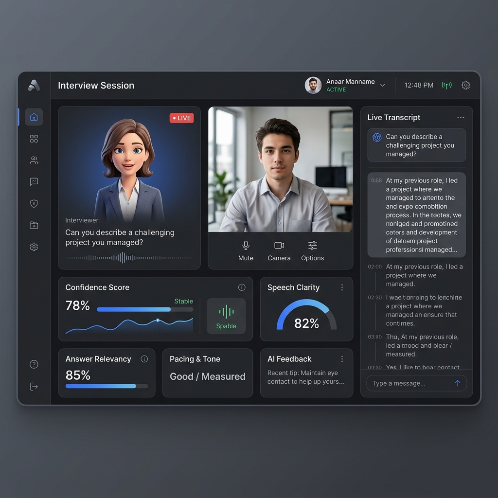

# 🚀 K. Saiteja - Professional Developer Portfolio

> **Building scalable, AI-powered applications with modern technologies.**
> Live Website: [k-saiteja.vercel.app](https://github.com/saiteja-025/Portfolio) (*Replace with your deployed URL*)

 <!-- Update this path if needed -->

A production-ready, highly optimized, and animated developer portfolio built using React, Vite, Tailwind CSS, and Framer Motion. Engineered to replicate the aesthetic quality of top-tier Silicon Valley engineers and startup founders.

---

## ⚡ Tech Stack & Architecture

- **Frontend Framework:** React (Vite)
- **Styling & Theming:** Tailwind CSS v3 (JIT Mode implemented with system-aware dark mode)
- **Animations:** Framer Motion (Scroll reveal logic, layout transitions)
- **Icons & Assets:** Lucide React, React Icons, Devicons vector pipeline
- **Routing:** React Router v6 (SPA Navigation with discrete product pages)
- **Email Pipeline:** FormSubmit endpoint integration

---

## ✨ Core Features

1. **Intelligent Dark/Light Mode Theme Toggle:** Robust system that directly hooks into actual `html` root tags saving natively to `localStorage`.
2. **Dedicated Project Runways:** High-fidelity dedicated routes (`/projects/:id`) modeling actual funded startup UI landing pages.
3. **Automated Serverless Contact Routing:** No-backend secure email architecture directly pinging your Gmail.
4. **Hardware Accelerated UI:** Custom Tailwind keyframes handling massive blob/noise background processing smoothly at 60FPS.
5. **Completely Mobile Responsive:** Mobile-first architecture that seamlessly adapts structural grids to any device.

---

## 🛠️ Local Development Setup

To run this repository locally:

### 1. Clone the repository
```bash
git clone https://github.com/saiteja-025/Portfolio.git
cd Portfolio
```

### 2. Install dependencies
```bash
npm install
```

### 3. Run the development server
```bash
npm run dev
```

Your app will be automatically running at `http://localhost:5173`.

---

## 🚀 Deployment Instructions

This repository is inherently optimized for seamless CI/CD integration with modern Edge platforms.

### Vercel Deployment (Recommended)
1. Commit and push this project to your GitHub.
2. Log into [Vercel](https://vercel.com).
3. Click **Add New Project** and select your `Portfolio` GitHub repository.
4. Framework Preset inherently detects `Vite`.
5. Root Directory defaults to `./`.
6. Click **Deploy**. Vercel will instantly push your application live!

### Netlify Deployment
1. Log into [Netlify](https://netlify.com).
2. Click **Add new site** -> **Import an existing project**.
3. Choose GitHub, authorize, and select your `Portfolio` repository.
4. Netlify will autodetect `npm run build` and the `dist` directory.
5. Click **Deploy Site**.

*Note: For single page app React Router to function properly on Netlify refreshes, make sure there is a `_redirects` file mapped in `./public/`.*

---

## 📜 Legal
Created by Kandagatla Saiteja.
